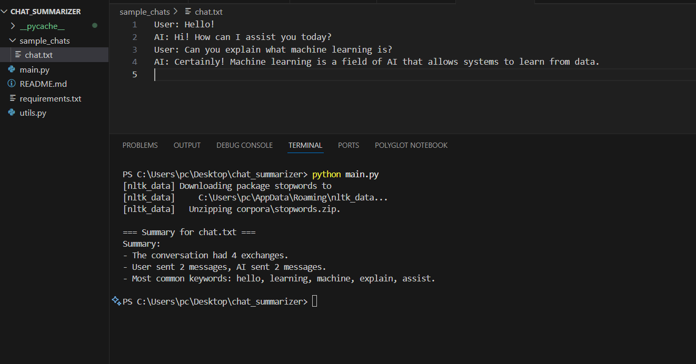
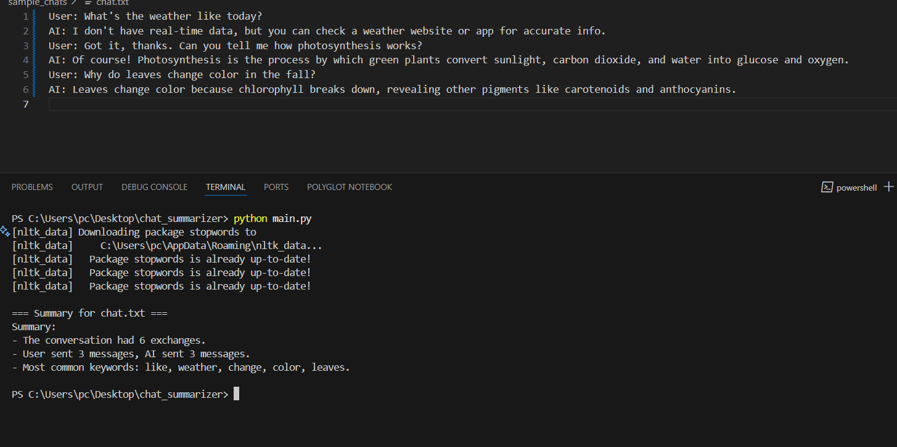

# 🧠 AI Chat Log Summarizer

This Python-based tool analyzes AI chat logs and provides a summary with message statistics and keyword insights.

---

## 🔧 Features

- Parses `.txt` chat logs with `User:` and `AI:` lines
- Counts total messages, by speaker
- Extracts top 5 keywords (frequency or TF-IDF)
- Summarizes individual or multiple chat files

---

## 🗂 Example Format-1
User: Hello!
AI: Hi! How can I assist you today?
User: Can you explain what machine learning is?
AI: Certainly! Machine learning is a field of AI that allows systems to learn from data.


## 🗂 Example Format-2
User: What's the weather like today?  
AI: I don't have real-time data, but you can check a weather website or app for accurate info.  
User: Got it, thanks. Can you tell me how photosynthesis works?  
AI: Of course! Photosynthesis is the process by which green plants convert sunlight, carbon dioxide, and water into glucose and oxygen.  
User: Why do leaves change color in the fall?  
AI: Leaves change color because chlorophyll breaks down, revealing other pigments like carotenoids and anthocyanins.  


---

## 🚀 How to Run

1. Install dependencies:
   ```bash
   pip install -r requirements.txt


2. Add .txt files inside sample_chats/
3. Run:

   ``````
   python main.py


📊 Example Output

==== Summary for chat.txt ====
Summary:
- The conversation had 4 exchanges.
- User sent 2 messages, AI sent 2 messages.
- Most common keywords: machine, learning, data, ai, systems.

<<<<<<< HEAD
####
Input & Output: image-1





####
Input & Output: image-2


