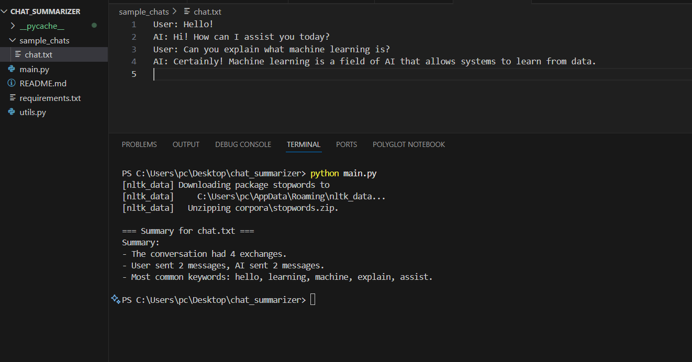

# 🧠 AI Chat Log Summarizer

This Python-based tool analyzes AI chat logs and provides a summary with message statistics and keyword insights.

---

## 🔧 Features

- Parses `.txt` chat logs with `User:` and `AI:` lines
- Counts total messages, by speaker
- Extracts top 5 keywords (frequency or TF-IDF)
- Summarizes individual or multiple chat files

---

## 🗂 Example Format
User: Hello!
AI: Hi! How can I assist you today?
User: Can you explain what machine learning is?
AI: Certainly! Machine learning is a field of AI that allows systems to learn from data.


---

## 🚀 How to Run

1. Install dependencies:
   ```bash
   pip install -r requirements.txt
``````````

2. Add .txt files inside sample_chats/
3. Run:

``````
python main.py

`````

📊 Example Output

==== Summary for chat.txt ====
Summary:
- The conversation had 4 exchanges.
- User sent 2 messages, AI sent 2 messages.
- Most common keywords: machine, learning, data, ai, systems.




c:\Users\pc\Desktop\chat_summarizer\image-1.png